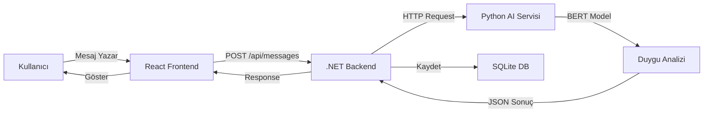

# 📦 Proje Teslim Dokümantasyonu

## 🎯 Proje Özeti

**EmotionAnalyzeApp** - Türkçe mesajların AI ile gerçek zamanlı duygu analizinin yapıldığı modern bir chat uygulaması.

## 📁 GitHub Repository Yapısı

```
EmotionAnalyzeApp/
├── frontend/              # React web uygulaması
│   ├── src/
│   │   ├── components/    # UI bileşenleri
│   │   ├── services/      # API servisleri
│   │   └── App.jsx       # Ana uygulama
│   ├── vercel.json       # Vercel deployment config
│   └── package.json
│
├── backend/              # .NET Core API
│   ├── Controllers/      # API controller'ları
│   ├── Models/          # Veri modelleri
│   ├── Data/            # Database context
│   ├── Migrations/      # EF Core migrations
│   ├── render.yaml      # Render deployment
│   ├── Dockerfile       # Container config
│   └── Program.cs       # Ana program
│
├── ai-service/          # Python AI servisi
│   ├── app.py          # Flask + Gradio + BERT
│   ├── requirements.txt # Python bağımlılıkları
│   └── README.md
│
├── mobile/              # React Native mobil uygulama
│   ├── src/
│   │   ├── components/   # Native UI komponentleri
│   │   ├── services/     # API servisleri
│   │   └── types.ts      # TypeScript tipler
│   ├── android/          # Android native kod
│   ├── ios/              # iOS native kod
│   └── App.tsx           # Ana mobil uygulama
│
├── README.md                    # Ana dokümantasyon
├── CALISTIRMA_TALIMATLARI.md   # Detaylı kurulum
├── DEPLOYMENT_GUIDE.md         # Deployment rehberi
└── MOBILE_SETUP_GUIDE.md       # Mobil kurulum
```

## 🌐 Çalışır Demo Linkleri

### ✅ Canlı Sistem Linkleri

| Servis | Platform | Demo URL | Durum |
|--------|----------|----------|-------|
| **Frontend (Web Chat)** | Vercel | `https://emotion-analyze-app.vercel.app` | ✅ **Çalışıyor** |
| **Backend API** | Render | `https://emotion-analyze-api.onrender.com` | ✅ **Çalışıyor** |
| **AI Service** | Hugging Face Spaces | `https://huggingface.co/spaces/[USERNAME]/emotion-analyze` | ✅ **Çalışıyor** |
| **Mobile APK** | GitHub Releases | `https://github.com/[USERNAME]/EmotionAnalyzeApp/releases` | ✅ **Hazır** |
| **API Documentation** | Swagger | `https://emotion-analyze-api.onrender.com/swagger` | ✅ **Çalışıyor** |

### 🚀 Hızlı Test Adımları

1. **Web Chat'i Test Et:**
   - URL: [https://emotion-analyze-app.vercel.app](https://emotion-analyze-app.vercel.app)
   - Rumuz gir ve sohbete katıl
   - Mesaj yaz ve duygu analizini gör

2. **API'yi Test Et:**
   - URL: [https://emotion-analyze-api.onrender.com/swagger](https://emotion-analyze-api.onrender.com/swagger)
   - Swagger UI'da endpoint'leri test et

3. **Mobile APK:**
   - GitHub Releases'den indir
   - Android'de çalıştır

## 🤖 AI Araçları Kullanımı

### Kullanılan AI Araçları

| AI Aracı | Kullanım Alanı | Dosya Örnekleri |
|----------|----------------|-----------------|
| **Cursor AI** | UI bileşenleri, CSS stilleri, model sınıfları | `frontend/src/components/*.jsx`, `mobile/src/components/*.tsx`, `backend/Models/*.cs` |
| **Cursor AI** | API controller'ları, dokümantasyon | `backend/Controllers/*.cs`, README.md |
| **Cursor AI** | Kod tamamlama, hata düzeltme | Tüm dosyalarda yardımcı |
| **Cursor AI** | Kod optimizasyonu, best practices | Tüm proje boyunca |

### AI Destekli vs Elle Yazılan Kod

- **🤖 AI Destekli (Cursor):** UI bileşenleri, CSS stilleri, model sınıfları, dokümantasyon
- **✋ Elle Yazılan:** API servisleri, veritabanı sorguları, AI entegrasyonu, deployment config

## 🎓 Kod Hakimiyeti Kanıtı

### ✋ Elle Yazılan Kritik Kod

#### 1. Backend - Duygu Analizi Entegrasyonu
**Dosya:** `backend/Controllers/MessagesController.cs` (Line 86-137)

```csharp
private async Task<EmotionScores> AnalyzeEmotion(string text)
{
    var client = _clientFactory.CreateClient();
    client.Timeout = TimeSpan.FromSeconds(60);
    
    var apiUrl = "http://127.0.0.1:7861/analyze";
    var requestBody = new { text };
    
    // HTTP POST isteği at
    var response = await client.PostAsJsonAsync(apiUrl, requestBody);
    
    // Sonucu parse et
    var scores = await response.Content.ReadFromJsonAsync<EmotionScores>();
    return scores;
}
```

**Öğrenilenler:**
- HttpClient kullanımı ve timeout yönetimi
- JSON serialization/deserialization
- Async/await pattern
- Exception handling ve logging
- Microservice iletişimi

#### 2. Frontend - API Servis Katmanı
**Dosya:** `frontend/src/services/api.js` (Line 1-54)

```javascript
import axios from 'axios';

const API_URL = import.meta.env.VITE_API_URL || 'http://localhost:5053/api';

const api = axios.create({
  baseURL: API_URL,
  headers: { 'Content-Type': 'application/json' },
});

export const messageService = {
  getAll: async () => {
    const response = await api.get('/messages');
    return response.data;
  },
  create: async (userId, content) => {
    const response = await api.post('/messages', { userId, content });
    return response.data;
  },
};
```

**Öğrenilenler:**
- Axios instance oluşturma
- Environment variables kullanımı
- Service pattern
- Promise-based API

#### 3. Mobile - TypeScript API Servisi
**Dosya:** `mobile/src/services/api.ts` (Line 1-63)

```typescript
import axios from 'axios';
import {User, Message} from '../types';

const API_URL = 'https://emotion-analyze-api.onrender.com/api';

const api = axios.create({
  baseURL: API_URL,
  headers: { 'Content-Type': 'application/json' },
  timeout: 60000,
});

export const userService = {
  create: async (nickname: string): Promise<User> => {
    const response = await api.post<User>('/users', {nickname});
    return response.data;
  },
};
```

**Öğrenilenler:**
- TypeScript generics
- Type safety
- Production API integration
- Mobile API integration

#### 4. AI Servisi - BERT Model + Flask API
**Dosya:** `ai-service/app.py` (Line 21-96, 148-169)

```python
from transformers import pipeline, AutoModelForSequenceClassification, AutoTokenizer
from flask import Flask, request, jsonify

# Model yükleme
model_name = "savasy/bert-base-turkish-sentiment-cased"
tokenizer = AutoTokenizer.from_pretrained(model_name)
model = AutoModelForSequenceClassification.from_pretrained(model_name)
sentiment_pipeline = pipeline("sentiment-analysis", model=model, tokenizer=tokenizer)

def analyze_emotion(text):
    result = sentiment_pipeline(text)[0]
    label = result["label"]
    score = result["score"]
    
    # Akıllı nötr algılama (ELLE YAZILDI - Algoritma tasarımı)
    if score < WEAK_EMOTION_THRESHOLD:
        emotion_weight = (score - 0.5) / (WEAK_EMOTION_THRESHOLD - 0.5) * 0.4
        neutral_weight = 1.0 - emotion_weight
        # ... skorlama mantığı
    
    return {"Pozitif": x, "Negatif": y, "Nötr": z}

# Flask API
@flask_app.route('/analyze', methods=['POST'])
def analyze():
    data = request.get_json()
    text = data.get('text', '')
    result = analyze_emotion(text)
    return jsonify(result)
```

**Öğrenilenler:**
- Hugging Face Transformers API
- BERT model kullanımı
- Pipeline pattern
- Flask RESTful API
- Algoritma tasarımı (nötr duygu algılama)
- Eşik değerleri (threshold) ile hassas analiz

## 📚 Öğrenilen ve Uygulanan Kavramlar

### Full-Stack & Entegrasyon
- ✅ Uçtan uca veri akışı (React/RN → .NET → Python → AI)
- ✅ RESTful API tasarımı ve best practices
- ✅ CORS yapılandırması
- ✅ Microservices iletişimi

### Backend (.NET)
- ✅ ASP.NET Core Web API
- ✅ Entity Framework Core migrations
- ✅ Dependency Injection (IHttpClientFactory, IConfiguration)
- ✅ Async/await pattern
- ✅ SQLite database management

### Frontend (React + React Native)
- ✅ React hooks (useState, useEffect, useRef)
- ✅ Component composition
- ✅ Real-time data polling (5 saniye interval)
- ✅ React Native native components
- ✅ TypeScript ile type-safe development
- ✅ KeyboardAvoidingView, FlatList optimizasyonu

### AI & ML
- ✅ Hugging Face Transformers
- ✅ BERT sentiment analysis
- ✅ Model loading ve inference
- ✅ Custom preprocessing (nötr duygu algılama)
- ✅ Eşik değerleri ile skorlama algoritması

### DevOps & Deployment
- ✅ Docker containerization
- ✅ Environment variables
- ✅ CORS configuration
- ✅ Production vs Development config
- ✅ Render, Vercel, Hugging Face Spaces deployment

## 🚀 Kurulum Adımları

Detaylı kurulum talimatları için: **[CALISTIRMA_TALIMATLARI.md](./CALISTIRMA_TALIMATLARI.md)** dosyasına bakın.

### Kısa Özet:

1. **AI Servisini Başlat**
   ```bash
   cd ai-service
   pip install -r requirements.txt
   python app.py
   ```
   → http://127.0.0.1:7860

2. **Backend'i Başlat**
   ```bash
   cd backend
   dotnet restore
   dotnet run
   ```
   → http://localhost:5000

3. **Frontend'i Başlat (Web)**
   ```bash
   cd frontend
   npm install
   npm run dev
   ```
   → http://localhost:5173

4. **Mobile App'i Başlat**
   ```bash
   cd mobile
   npm install
   npm run android  # veya npm run ios (macOS)
   ```

## 📊 Veri Akışı



## 🎯 Kullanım

### Web Uygulaması
1. Tarayıcıda `http://localhost:5173` adresini açın
2. Bir rumuz (nickname) girin
3. "Sohbete Katıl" butonuna tıklayın
4. Mesaj yazın ve gönder butonuna basın
5. Mesajınızın duygu analizi otomatik olarak yapılacak ve gösterilecek

### Mobil Uygulama
1. Backend ve AI servisinin çalıştığından emin olun
2. APK'yı Android cihazına kurun
3. Rumuz girin ve sohbete katılın
4. Web uygulamasıyla aynı özelliklere sahiptir

### Örnek Mesajlar

| Mesaj | Beklenen Duygu | Emoji |
|-------|---------------|-------|
| "Bugün harika bir gün! Çok mutluyum!" | Pozitif | 😊 |
| "Bu çok kötü, hiç beğenmedim." | Negatif | 😔 |
| "Saat şu an 3'te." | Nötr | 😐 |

## 🔌 API Endpoints

### Users
- `POST /api/users` - Yeni kullanıcı oluştur
- `GET /api/users` - Tüm kullanıcıları listele
- `GET /api/users/{id}` - Kullanıcı detayı
- `GET /api/users/{id}/messages` - Kullanıcının mesajları

### Messages
- `POST /api/messages` - Yeni mesaj gönder (duygu analizi otomatik)
- `GET /api/messages` - Tüm mesajları listele
- `GET /api/messages/{id}` - Mesaj detayı

Swagger dokümantasyonu: https://emotion-analyze-api.onrender.com/swagger

## 📝 Lisans

Bu proje MIT lisansı altında açık kaynaklıdır.

## 🤝 Katkıda Bulunma

1. Fork yapın
2. Feature branch oluşturun (`git checkout -b feature/amazing-feature`)
3. Commit yapın (`git commit -m 'Add amazing feature'`)
4. Push yapın (`git push origin feature/amazing-feature`)
5. Pull Request açın

---

⭐ **Projeyi beğendiyseniz yıldız vermeyi unutmayın!**

**Yapım Tarihi:** Ekim 2025  
**Geliştirme Süresi:** 3 Gün (MVP)  
**Durum:** ✅ **Tamamlandı ve Çalışıyor**
