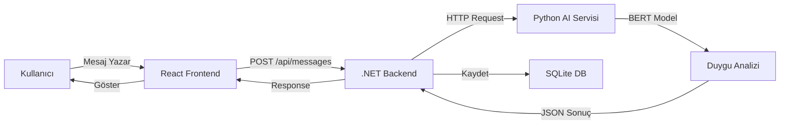

# 🎭 Emotion Analyze App

Türkçe mesajların AI ile gerçek zamanlı duygu analizinin yapıldığı modern bir chat uygulaması.

   

## 🌟 Özellikler

- 🤖 **AI Tabanlı Duygu Analizi** - BERT modeli ile Türkçe duygu analizi (Pozitif/Negatif/Nötr)
- 💬 **Gerçek Zamanlı Chat** - Kullanıcılar arası mesajlaşma
- 🎨 **Modern UI** - Gradient tasarım ve smooth animasyonlar
- 😊 **Emoji Göstergeler** - Görsel duygu durumu gösterimi
- 📊 **Skor Sistemi** - Yüzdelik duygu analizi skorları
- 🔄 **Otomatik Güncelleme** - 5 saniyede bir mesaj senkronizasyonu
- 📱 **Responsive Tasarım** - Mobil ve desktop uyumlu

## 🏗️ Teknoloji Stack

### Frontend
- **React 19** - Modern UI kütüphanesi
- **Vite** - Hızlı build aracı
- **Axios** - HTTP client
- **CSS3** - Modern styling ve animasyonlar

### Backend
- **.NET 9.0 Core** - RESTful API
- **Entity Framework Core** - ORM
- **SQLite** - Hafif veritabanı
- **ASP.NET Core Web API** - API framework

### AI Servisi
- **Python 3.8+** - AI servisi
- **Transformers** - Hugging Face kütüphanesi
- **Gradio** - Web arayüzü ve API
- **BERT Model** - `savasy/bert-base-turkish-sentiment-cased`

## 📁 Proje Yapısı

```
EmotionAnalyzeApp/
├── frontend/              # React web uygulaması
│   ├── src/
│   │   ├── components/   # UI bileşenleri
│   │   ├── services/     # API servisleri
│   │   └── App.jsx       # Ana uygulama
│   └── package.json
│
├── backend/              # .NET Core API
│   ├── Controllers/      # API controller'ları
│   ├── Models/          # Veri modelleri
│   ├── Data/            # Database context
│   └── Program.cs       # Ana program
│
├── ai-service/          # Python AI servisi
│   ├── app.py          # Gradio uygulaması
│   └── requirements.txt # Python bağımlılıkları
│
└── README.md
```

## 🚀 Hızlı Başlangıç

### Gereksinimler
- Python 3.8+
- .NET 9.0 SDK
- Node.js 18+
- npm veya yarn

### Kurulum

Detaylı kurulum talimatları için: **[CALISTIRMA_TALIMATLARI.md](./CALISTIRMA_TALIMATLARI.md)** dosyasına bakın.

#### Kısa Özet:

1. **AI Servisini Başlat**
   ```bash
   cd ai-service
   pip install -r requirements.txt
   python app.py
   ```
   → http://127.0.0.1:7860

2. **Backend'i Başlat**
   ```bash
   cd backend
   dotnet restore
   dotnet run
   ```
   → http://localhost:5000

3. **Frontend'i Başlat**
   ```bash
   cd frontend
   npm install
   npm run dev
   ```
   → http://localhost:5173

## 🎯 Kullanım

1. Tarayıcıda `http://localhost:5173` adresini açın
2. Bir rumuz (nickname) girin
3. "Sohbete Katıl" butonuna tıklayın
4. Mesaj yazın ve gönder butonuna basın
5. Mesajınızın duygu analizi otomatik olarak yapılacak ve gösterilecek

### Örnek Mesajlar

| Mesaj | Beklenen Duygu | Emoji |
|-------|---------------|-------|
| "Bugün harika bir gün! Çok mutluyum!" | Pozitif | 😊 |
| "Bu çok kötü, hiç beğenmedim." | Negatif | 😔 |
| "Saat şu an 3'te." | Nötr | 😐 |

## 📊 Veri Akışı



## 🔌 API Endpoints

### Users
- `POST /api/users` - Yeni kullanıcı oluştur
- `GET /api/users` - Tüm kullanıcıları listele
- `GET /api/users/{id}` - Kullanıcı detayı
- `GET /api/users/{id}/messages` - Kullanıcının mesajları

### Messages
- `POST /api/messages` - Yeni mesaj gönder (duygu analizi otomatik)
- `GET /api/messages` - Tüm mesajları listele
- `GET /api/messages/{id}` - Mesaj detayı

Swagger dokümantasyonu: http://localhost:5000/swagger

## 🎓 Kod Hakimiyeti ve AI Kullanımı

### Elle Yazılan Kod
- ✋ `backend/Controllers/MessagesController.cs` - API endpoint'leri ve duygu analizi entegrasyonu
- ✋ `frontend/src/services/api.js` - Axios HTTP istekleri
- ✋ `ai-service/app.py` - Gradio arayüzü ve model entegrasyonu

### AI Destekli Kod
- 🤖 Frontend UI bileşenleri (ChatRoom, MessageItem, UserLogin)
- 🤖 CSS stilleri ve animasyonlar
- 🤖 Backend model sınıfları ve DbContext

### Öğrenilen Kavramlar
- Full-stack entegrasyon (React → .NET → Python)
- RESTful API tasarımı
- Hugging Face Transformers kullanımı
- Gradio API endpoint'leri
- Entity Framework Core migrations
- Real-time data polling

## 🌐 Deployment Planı

### Ücretsiz Hosting Platformları

| Servis | Platform | URL |
|--------|----------|-----|
| AI Service | Hugging Face Spaces | `https://huggingface.co/spaces/` |
| Backend API | Render (Free Tier) | `https://render.com` |
| Frontend | Vercel | `https://vercel.com` |

Deployment adımları için ayrı dokümantasyon hazırlanacak.

## 🧪 Test

### Manuel Test
1. Farklı duygu durumlarını test edin (pozitif, negatif, nötr)
2. Çoklu kullanıcı senaryolarını test edin
3. Uzun mesajları test edin (max 500 karakter)

### API Test
Swagger UI kullanarak endpoint'leri test edebilirsiniz:
```
http://localhost:5000/swagger
```

## 📝 Lisans

Bu proje MIT lisansı altında açık kaynaklıdır.

## 🤝 Katkıda Bulunma

1. Fork yapın
2. Feature branch oluşturun (`git checkout -b feature/amazing-feature`)
3. Commit yapın (`git commit -m 'Add amazing feature'`)
4. Push yapın (`git push origin feature/amazing-feature`)
5. Pull Request açın

## 📧 İletişim

Sorular ve öneriler için issue açabilirsiniz.

---

⭐ Projeyi beğendiyseniz yıldız vermeyi unutmayın!

**Yapım Tarihi:** Ekim 2025  
**Geliştirme Süresi:** 3 Gün (MVP)

