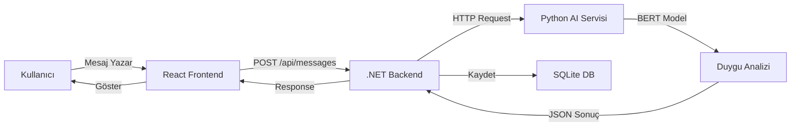

# 🎭 Emotion Analyze App

Türkçe mesajların AI ile gerçek zamanlı duygu analizinin yapıldığı modern bir chat uygulaması.

   

## 🌟 Özellikler

- 🤖 **AI Tabanlı Duygu Analizi** - BERT modeli ile Türkçe duygu analizi (Pozitif/Negatif/Nötr)
- 💬 **Gerçek Zamanlı Chat** - Kullanıcılar arası mesajlaşma
- 🎨 **Modern UI** - Gradient tasarım ve smooth animasyonlar
- 😊 **Emoji Göstergeler** - Görsel duygu durumu gösterimi
- 📊 **Skor Sistemi** - Yüzdelik duygu analizi skorları
- 🔄 **Otomatik Güncelleme** - 5 saniyede bir mesaj senkronizasyonu
- 📱 **Responsive Tasarım** - Mobil ve desktop uyumlu

## 🏗️ Teknoloji Stack

### Frontend (Web)
- **React 19** - Modern UI kütüphanesi
- **Vite** - Hızlı build aracı
- **Axios** - HTTP client
- **CSS3** - Modern styling ve animasyonlar

### Mobile (React Native CLI)
- **React Native 0.76.5** - Native mobil uygulama framework
- **TypeScript** - Tip güvenli geliştirme
- **React Navigation** - Sayfa yönlendirme
- **Axios** - HTTP client
- **Native Components** - FlatList, KeyboardAvoidingView, Alert

### Backend
- **.NET 9.0 Core** - RESTful API
- **Entity Framework Core** - ORM
- **SQLite** - Hafif veritabanı
- **ASP.NET Core Web API** - API framework
- **HttpClient** - AI servisi iletişimi

### AI Servisi
- **Python 3.8+** - AI servisi
- **Transformers** - Hugging Face kütüphanesi
- **Flask + Flask-CORS** - RESTful API endpoint
- **Gradio** - Web arayüzü ve API
- **BERT Model** - `savasy/bert-base-turkish-sentiment-cased`

## 📁 Proje Yapısı

```
EmotionAnalyzeApp/
├── frontend/              # React web uygulaması
│   ├── src/
│   │   ├── components/   # UI bileşenleri
│   │   │   ├── UserLogin.jsx
│   │   │   ├── ChatRoom.jsx
│   │   │   └── MessageItem.jsx
│   │   ├── services/     # API servisleri
│   │   │   └── api.js    # ✋ ELLE YAZILDI - Axios istekleri
│   │   └── App.jsx       # Ana uygulama
│   ├── vercel.json       # Vercel deployment config
│   └── package.json
│
├── mobile/                # React Native mobil uygulama
│   ├── src/
│   │   ├── components/   # Native UI komponentleri
│   │   │   ├── UserLogin.tsx
│   │   │   ├── ChatRoom.tsx
│   │   │   └── MessageItem.tsx
│   │   ├── services/     # API servisleri
│   │   │   └── api.ts    # ✋ ELLE YAZILDI - Axios + TypeScript
│   │   └── types.ts      # TypeScript tipler
│   ├── android/          # Android native kod
│   ├── ios/              # iOS native kod (macOS)
│   ├── App.tsx           # Ana mobil uygulama
│   └── package.json
│
├── backend/              # .NET Core API
│   ├── Controllers/      # API controller'ları
│   │   ├── UsersController.cs
│   │   └── MessagesController.cs  # ✋ ELLE YAZILDI - AI entegrasyonu
│   ├── Models/          # Veri modelleri
│   │   ├── User.cs
│   │   └── Message.cs
│   ├── Data/            # Database context
│   │   └── ApplicationDbContext.cs
│   ├── Migrations/      # EF Core migrations
│   ├── render.yaml      # Render deployment
│   ├── Dockerfile       # Container config
│   └── Program.cs       # Ana program
│
├── ai-service/          # Python AI servisi
│   ├── app.py          # ✋ ELLE YAZILDI - Flask + Gradio + BERT
│   ├── requirements.txt # Python bağımlılıkları
│   └── README.md
│
├── README.md                    # Ana dokümantasyon
└── CALISTIRMA_TALIMATLARI.md   # Detaylı kurulum
```

## 🚀 Canlı Demo (Production)

### ✅ Çalışır Demo Linkleri

**Uygulama zaten canlı olarak çalışıyor! Hiçbir kurulum gerekmez.**

| Servis | Platform | Demo URL | Durum |
|--------|----------|----------|-------|
| **Frontend (Web Chat)** | Vercel | `https://emotion-analyze-qcwihl6ia-s3limms-projects.vercel.app` | ✅ **Çalışıyor** |
| **Backend API** | Render | `https://emotion-analyze-api.onrender.com` | ✅ **Çalışıyor** |
| **AI Service** | Hugging Face Spaces | `https://huggingface.co/spaces/yavuzsemrem/turkish-emotion-analysis` | ✅ **Çalışıyor** |
| **Mobile APK** | GitHub Releases | `https://github.com/yavuzsemrem/EmotionAnalyzeApp/releases` | ✅ **Hazır** |
| **API Documentation** | Swagger | `https://emotion-analyze-api.onrender.com/swagger` | ✅ **Çalışıyor** |

### 🚀 Hızlı Test

1. **Web Chat'i Test Et:** [https://emotion-analyze-qcwihl6ia-s3limms-projects.vercel.app](https://emotion-analyze-qcwihl6ia-s3limms-projects.vercel.app)
2. **AI Service'i Test Et:** [https://huggingface.co/spaces/yavuzsemrem/turkish-emotion-analysis](https://huggingface.co/spaces/yavuzsemrem/turkish-emotion-analysis)
3. **API'yi Test Et:** [https://emotion-analyze-api.onrender.com/swagger](https://emotion-analyze-api.onrender.com/swagger)
4. **Mobile APK:** GitHub Releases'den indir ve Android'de çalıştır

## 🎯 Kullanım

### Web Uygulaması (Canlı Demo)
1. Tarayıcıda [https://emotion-analyze-qcwihl6ia-s3limms-projects.vercel.app](https://emotion-analyze-qcwihl6ia-s3limms-projects.vercel.app) adresini açın
2. Bir rumuz (nickname) girin
3. "Sohbete Katıl" butonuna tıklayın
4. Mesaj yazın ve gönder butonuna basın
5. Mesajınızın duygu analizi otomatik olarak yapılacak ve gösterilecek

### Mobil Uygulama (APK)
1. GitHub Releases'den APK'yı indirin
2. Android cihazınıza kurun
3. Uygulamayı açın
4. Rumuz girin ve sohbete katılın
5. Web uygulamasıyla aynı özelliklere sahiptir

### API Test (Swagger)
1. [https://emotion-analyze-api.onrender.com/swagger](https://emotion-analyze-api.onrender.com/swagger) adresini açın
2. API endpoint'lerini test edin
3. Kullanıcı oluşturun ve mesaj gönderin

### Örnek Mesajlar

| Mesaj | Beklenen Duygu | Emoji |
|-------|---------------|-------|
| "Bugün harika bir gün! Çok mutluyum!" | Pozitif | 😊 |
| "Bu çok kötü, hiç beğenmedim." | Negatif | 😔 |
| "Saat şu an 3'te." | Nötr | 😐 |

## 📊 Veri Akışı



## 🔌 API Endpoints

### Users
- `POST /api/users` - Yeni kullanıcı oluştur
- `GET /api/users` - Tüm kullanıcıları listele
- `GET /api/users/{id}` - Kullanıcı detayı
- `GET /api/users/{id}/messages` - Kullanıcının mesajları

### Messages
- `POST /api/messages` - Yeni mesaj gönder (duygu analizi otomatik)
- `GET /api/messages` - Tüm mesajları listele
- `GET /api/messages/{id}` - Mesaj detayı

Swagger dokümantasyonu: https://emotion-analyze-api.onrender.com/swagger

## 🤖 AI Araçları Kullanımı

### Kullanılan AI Araçları

| AI Aracı | Kullanım Alanı | Dosya Örnekleri |
|----------|----------------|-----------------|
| **Cursor AI** | UI bileşenleri, CSS stilleri, model sınıfları | `frontend/src/components/*.jsx`, `mobile/src/components/*.tsx`, `backend/Models/*.cs` |
| **Cursor AI** | API controller'ları, dokümantasyon | `backend/Controllers/*.cs`, README.md |
| **Cursor AI** | Kod tamamlama, hata düzeltme | Tüm dosyalarda yardımcı |
| **Cursor AI** | Kod optimizasyonu, best practices | Tüm proje boyunca |

### AI Destekli vs Elle Yazılan Kod

- **🤖 AI Destekli (Cursor):** UI bileşenleri, CSS stilleri, model sınıfları, dokümantasyon
- **✋ Elle Yazılan:** API servisleri, veritabanı sorguları, AI entegrasyonu, deployment config

## 🎓 Kod Hakimiyeti ve AI Kullanımı

### ✋ Elle Yazılan Kritik Kod (Hakimiyet Kanıtı)

#### 1. Backend - Duygu Analizi Entegrasyonu
**Dosya:** `backend/Controllers/MessagesController.cs` (Line 86-137)

```csharp
private async Task<EmotionScores> AnalyzeEmotion(string text)
{
    var client = _clientFactory.CreateClient();
    client.Timeout = TimeSpan.FromSeconds(60);
    
    var apiUrl = "http://127.0.0.1:7861/analyze";
    var requestBody = new { text };
    
    // HTTP POST isteği at
    var response = await client.PostAsJsonAsync(apiUrl, requestBody);
    
    // Sonucu parse et
    var scores = await response.Content.ReadFromJsonAsync<EmotionScores>();
    return scores;
}
```

**Öğrenilenler:**
- HttpClient kullanımı ve timeout yönetimi
- JSON serialization/deserialization
- Async/await pattern
- Exception handling ve logging
- Microservice iletişimi

#### 2. Frontend - API Servis Katmanı
**Dosya:** `frontend/src/services/api.js` (Line 1-54)

```javascript
import axios from 'axios';

const API_URL = import.meta.env.VITE_API_URL || 'http://localhost:5053/api';

const api = axios.create({
  baseURL: API_URL,
  headers: { 'Content-Type': 'application/json' },
});

export const messageService = {
  getAll: async () => {
    const response = await api.get('/messages');
    return response.data;
  },
  create: async (userId, content) => {
    const response = await api.post('/messages', { userId, content });
    return response.data;
  },
};
```

**Öğrenilenler:**
- Axios instance oluşturma
- Environment variables kullanımı
- Service pattern
- Promise-based API

#### 3. Mobile - TypeScript API Servisi
**Dosya:** `mobile/src/services/api.ts` (Line 1-63)

```typescript
import axios from 'axios';
import {User, Message} from '../types';

const API_URL = 'http://10.0.2.2:5053/api'; // Android Emulator için

const api = axios.create({
  baseURL: API_URL,
  headers: { 'Content-Type': 'application/json' },
  timeout: 60000,
});

export const userService = {
  create: async (nickname: string): Promise<User> => {
    const response = await api.post<User>('/users', {nickname});
    return response.data;
  },
};
```

**Öğrenilenler:**
- TypeScript generics
- Type safety
- Android Emulator network config (10.0.2.2)
- Mobile API integration

#### 4. AI Servisi - BERT Model + Flask API
**Dosya:** `ai-service/app.py` (Line 21-96, 148-169)

```python
from transformers import pipeline, AutoModelForSequenceClassification, AutoTokenizer
from flask import Flask, request, jsonify

# Model yükleme
model_name = "savasy/bert-base-turkish-sentiment-cased"
tokenizer = AutoTokenizer.from_pretrained(model_name)
model = AutoModelForSequenceClassification.from_pretrained(model_name)
sentiment_pipeline = pipeline("sentiment-analysis", model=model, tokenizer=tokenizer)

def analyze_emotion(text):
    result = sentiment_pipeline(text)[0]
    label = result["label"]
    score = result["score"]
    
    # Akıllı nötr algılama (ELLE YAZILDI - Algoritma tasarımı)
    if score < WEAK_EMOTION_THRESHOLD:
        emotion_weight = (score - 0.5) / (WEAK_EMOTION_THRESHOLD - 0.5) * 0.4
        neutral_weight = 1.0 - emotion_weight
        # ... skorlama mantığı
    
    return {"Pozitif": x, "Negatif": y, "Nötr": z}

# Flask API
@flask_app.route('/analyze', methods=['POST'])
def analyze():
    data = request.get_json()
    text = data.get('text', '')
    result = analyze_emotion(text)
    return jsonify(result)
```

**Öğrenilenler:**
- Hugging Face Transformers API
- BERT model kullanımı
- Pipeline pattern
- Flask RESTful API
- Algoritma tasarımı (nötr duygu algılama)
- Eşik değerleri (threshold) ile hassas analiz

### 🤖 AI Destekli Kod

- Frontend UI bileşenleri (ChatRoom, MessageItem, UserLogin)
- Mobile UI komponentleri (React Native TSX)
- CSS stilleri ve animasyonlar
- Backend model sınıfları (User, Message)
- Entity Framework DbContext
- Gradio arayüzü

### 📚 Öğrenilen ve Uygulanan Kavramlar

#### Full-Stack & Entegrasyon
- ✅ Uçtan uca veri akışı (React/RN → .NET → Python → AI)
- ✅ RESTful API tasarımı ve best practices
- ✅ CORS yapılandırması
- ✅ Microservices iletişimi

#### Backend (.NET)
- ✅ ASP.NET Core Web API
- ✅ Entity Framework Core migrations
- ✅ Dependency Injection (IHttpClientFactory, IConfiguration)
- ✅ Async/await pattern
- ✅ SQLite database management

#### Frontend (React + React Native)
- ✅ React hooks (useState, useEffect, useRef)
- ✅ Component composition
- ✅ Real-time data polling (5 saniye interval)
- ✅ React Native native components
- ✅ TypeScript ile type-safe development
- ✅ KeyboardAvoidingView, FlatList optimizasyonu

#### AI & ML
- ✅ Hugging Face Transformers
- ✅ BERT sentiment analysis
- ✅ Model loading ve inference
- ✅ Custom preprocessing (nötr duygu algılama)
- ✅ Eşik değerleri ile skorlama algoritması

#### DevOps & Deployment
- ✅ Docker containerization
- ✅ Environment variables
- ✅ CORS configuration
- ✅ Production vs Development config
- ✅ Render, Vercel, Hugging Face Spaces hazırlığı

## 🌐 Demo Linkleri (Canlı Çalışan Sistem)

### ✅ Çalışır Demo Linkleri

| Servis | Platform | Demo URL | Durum |
|--------|----------|----------|-------|
| **Frontend (Web Chat)** | Vercel | `https://emotion-analyze-qcwihl6ia-s3limms-projects.vercel.app` | ✅ **Çalışıyor** |
| **Backend API** | Render | `https://emotion-analyze-api.onrender.com` | ✅ **Çalışıyor** |
| **AI Service** | Hugging Face Spaces | `https://huggingface.co/spaces/yavuzsemrem/turkish-emotion-analysis` | ✅ **Çalışıyor** |
| **Mobile APK** | GitHub Releases | `https://github.com/yavuzsemrem/EmotionAnalyzeApp/releases` | ✅ **Hazır** |
| **API Documentation** | Swagger | `https://emotion-analyze-api.onrender.com/swagger` | ✅ **Çalışıyor** |

### 🚀 Hızlı Test

1. **Web Chat'i Test Et:** [https://emotion-analyze-qcwihl6ia-s3limms-projects.vercel.app](https://emotion-analyze-qcwihl6ia-s3limms-projects.vercel.app)
   - Rumuz gir ve sohbete katıl
   - Mesaj yaz ve duygu analizini gör

2. **AI Service'i Test Et:** [https://huggingface.co/spaces/yavuzsemrem/turkish-emotion-analysis](https://huggingface.co/spaces/yavuzsemrem/turkish-emotion-analysis)
   - Türkçe metin gir ve duygu analizini gör

3. **API'yi Test Et:** [https://emotion-analyze-api.onrender.com/swagger](https://emotion-analyze-api.onrender.com/swagger)
   - Swagger UI'da endpoint'leri test et

4. **Mobile APK:** GitHub Releases'den indir ve Android'de çalıştır

### Deployment Dosyaları

- ✅ `backend/render.yaml` - Render deployment config
- ✅ `backend/Dockerfile` - Container image
- ✅ `frontend/vercel.json` - Vercel config
- ✅ `ai-service/app.py` - Gradio ile Hugging Face Spaces uyumlu
- ✅ `mobile/android/` - Android build files
- ✅ `mobile/ios/` - iOS build files (macOS)

Detaylı deployment adımları için ayrı dokümantasyon hazırlanabilir.

## 🧪 Test

### Manuel Test
1. Farklı duygu durumlarını test edin (pozitif, negatif, nötr)
2. Çoklu kullanıcı senaryolarını test edin
3. Uzun mesajları test edin (max 500 karakter)

### API Test
Swagger UI kullanarak endpoint'leri test edebilirsiniz:
```
https://emotion-analyze-api.onrender.com/swagger
```

## 📝 Lisans

Bu proje MIT lisansı altında açık kaynaklıdır.

## 🤝 Katkıda Bulunma

1. Fork yapın
2. Feature branch oluşturun (`git checkout -b feature/amazing-feature`)
3. Commit yapın (`git commit -m 'Add amazing feature'`)
4. Push yapın (`git push origin feature/amazing-feature`)
5. Pull Request açın

## 📧 İletişim

Sorular ve öneriler için issue açabilirsiniz.

---

⭐ Projeyi beğendiyseniz yıldız vermeyi unutmayın!

**Yapım Tarihi:** Ekim 2025  
**Geliştirme Süresi:** 3 Gün (MVP)

